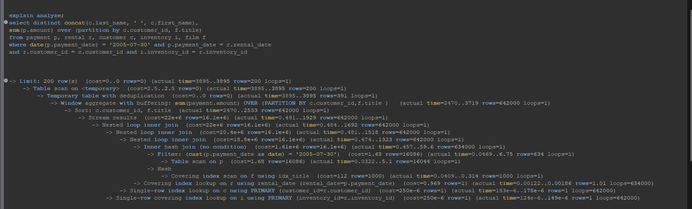

# Домашнее задание к занятию «Индексы» | "Бойко Владислав"
---
## Задание 1
Стыдно, стыдно;
неловко, неловко.
Вроде бы так вот правильно. Получаем что то около 40 %
```mysql
SELECT sum(index_length) / sum(data_length) * 100
FROM INFORMATION_SCHEMA.TABLES
```

---
## Задание 2 
Из прочтенного и проанализированного видно что прям вот узким горлышком является оконная функция, а именно попытка сгруппировать сразу по двум столбцам из разных таблиц

Путем банального удаления f.title и film f из запроса мы получим идентичный результат, но теперь ответ происходит за 10 милисекунд вместо 3.5 секунд 

Далее можно удалить табличку inventory i и соответствующее условие вывод так же не изменится + sql не нужно делать лишние джоины.
UPD насколько понял оконная функция почему то делает обычный тейбл скан, перебекая все строки по пол милиона несколько раз. А добавление индекса в payment amount доло ровным счетом ничего(в целом и не должно было что то дать, т.к. в данном случаее мы не ищим мы складываем строки).
Думается мне что я сделал что то не так.

Что-то там скачет на уровне погрешности
---
<<<<<<< HEAD
## Задание 2 исправленное 
```mysql
explain analyze;
select distinct concat(c.last_name, ' ', c.first_name), sum(p.amount)
from payment p
inner join rental r on p.rental_id = r.rental_id
inner join customer c on p.customer_id = c.customer_id 
where p.payment_date >= '2005-07-30' and p.payment_date < DATE_ADD('2005-07-30', INTERVAL 1 DAY) and p.payment_date = r.rental_date 
and r.customer_id = c.customer_id
group by c.customer_id


CREATE index pay_date_index on payment(payment_date)


-> Limit: 1000 row(s)  (actual time=4.48..4.53 rows=391 loops=1)
    -> Sort with duplicate removal: `concat(c.last_name, ' ', c.first_name)`, `sum(p.amount)`  (actual time=4.48..4.51 rows=391 loops=1)
        -> Table scan on <temporary>  (actual time=4.24..4.29 rows=391 loops=1)
            -> Aggregate using temporary table  (actual time=4.24..4.24 rows=391 loops=1)
                -> Nested loop inner join  (cost=572 rows=31.7) (actual time=0.0387..3.69 rows=634 loops=1)
                    -> Nested loop inner join  (cost=349 rows=634) (actual time=0.0241..1.36 rows=634 loops=1)
                        -> Filter: ((r.rental_date >= TIMESTAMP'2005-07-30 00:00:00') and (r.rental_date < <cache>(('2005-07-30' + interval 1 day))))  (cost=127 rows=634) (actual time=0.0162..0.439 rows=634 loops=1)
                            -> Covering index range scan on r using rental_date over ('2005-07-30 00:00:00' <= rental_date < '2005-07-31 00:00:00')  (cost=127 rows=634) (actual time=0.0148..0.326 rows=634 loops=1)
                        -> Single-row index lookup on c using PRIMARY (customer_id=r.customer_id)  (cost=0.25 rows=1) (actual time=0.00127..0.0013 rows=1 loops=634)
                    -> Filter: ((p.customer_id = r.customer_id) and (p.payment_date = r.rental_date))  (cost=0.251 rows=0.05) (actual time=0.00273..0.00349 rows=1 loops=634)
                        -> Index lookup on p using fk_payment_rental (rental_id=r.rental_id)  (cost=0.251 rows=1) (actual time=0.00251..0.00321 rows=1 loops=634)
```

---
## Задание 3
PostgreSQL поддерживает несколько типов индексов: B-дерево, хеш, GiST и SP-GiST(R-дерево), инвертированный индекс, Bitmap, Partial index или же частичный индекс, Function-based index - индексы, ключи которых хранят результат пользовательских функций
В mysql присутствуют В-деревья, хеши(только в таблицах типа memory), есть так же Spatial аналаг для GiST и SP-GiST так же является r-деревом, инвертированный индекс, остальное не поддерживает.
---